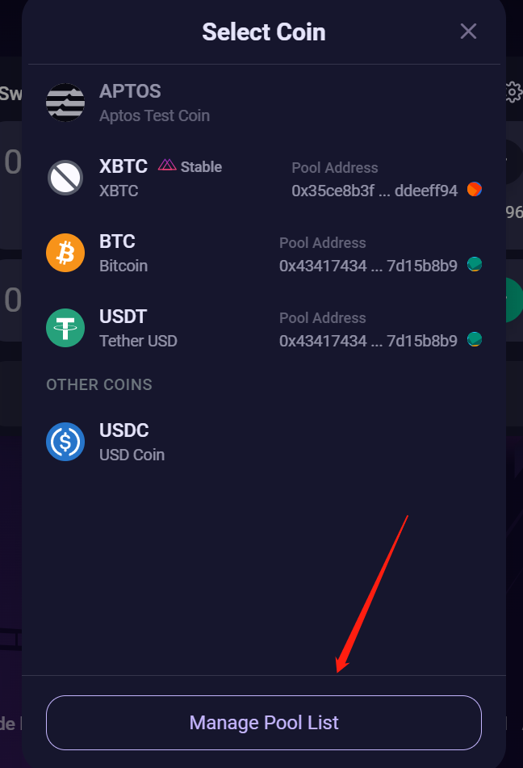
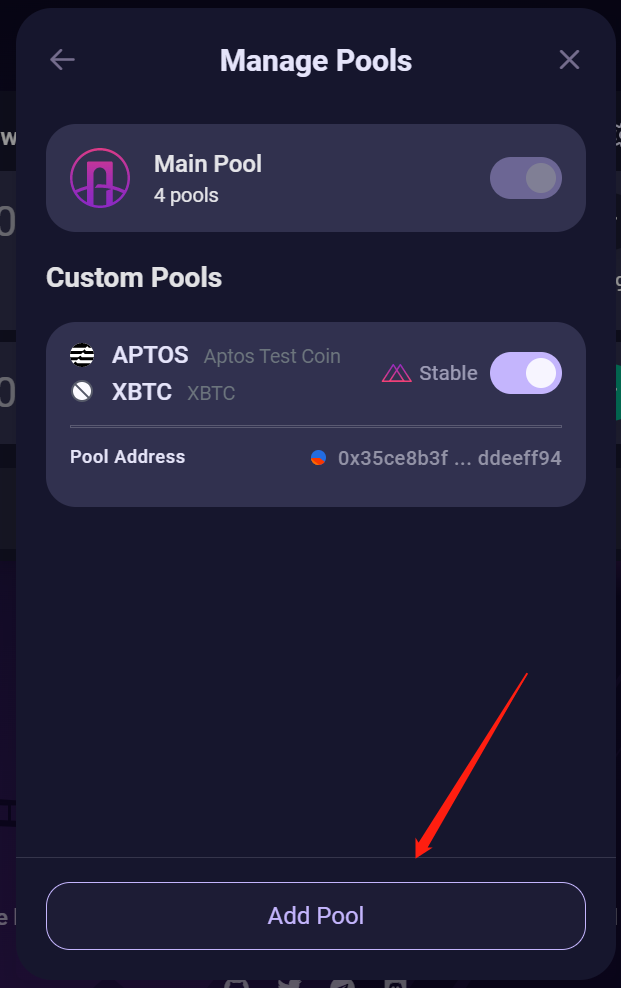
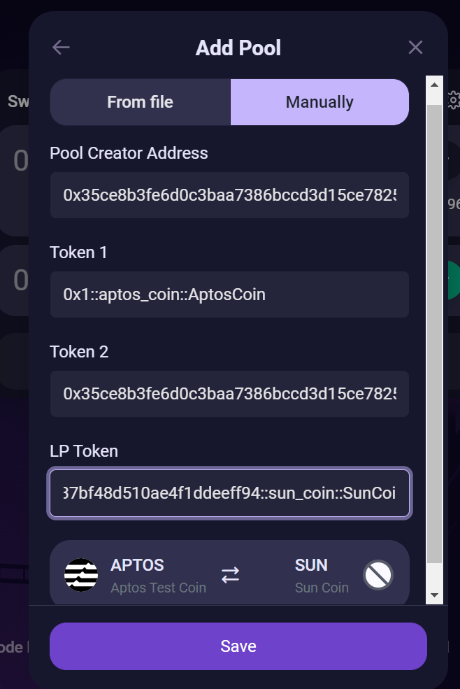
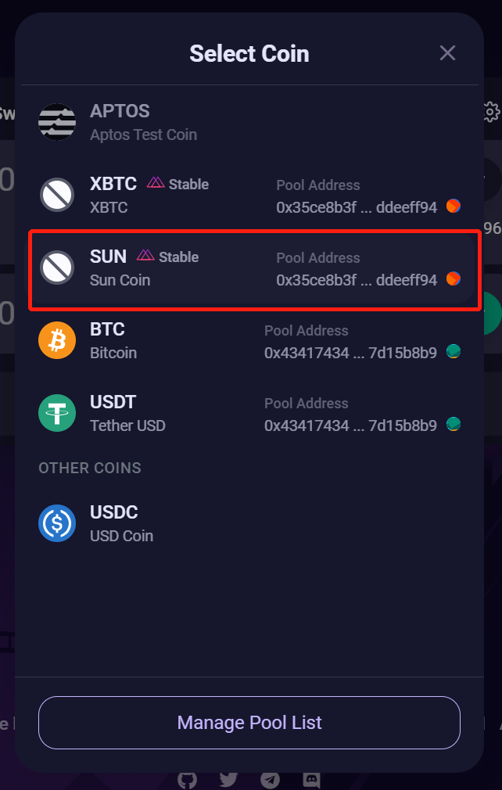
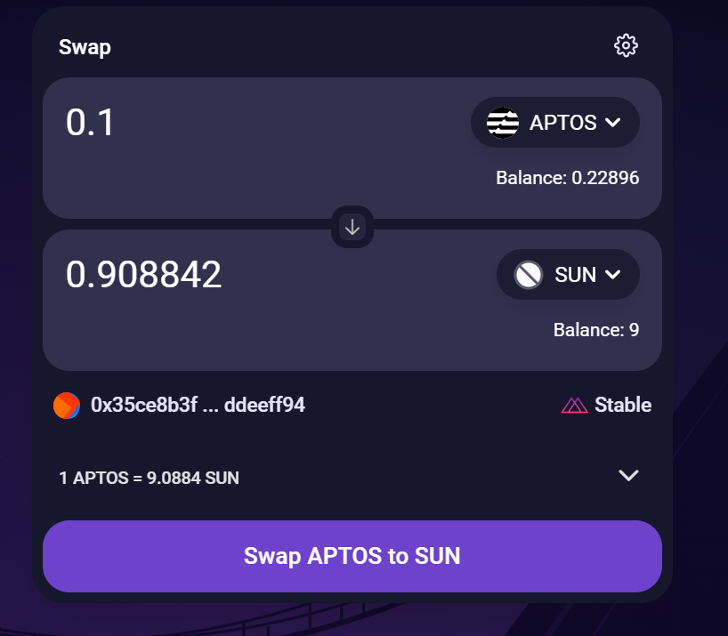

# liquidswap-pool-example

- [liquidswap-pool-example](#liquidswap-pool-example)
  - [init your local env](#init-your-local-env)
  - [publish & mint your coin](#publish--mint-your-coin)
  - [publish your LP](#publish-your-lp)
  - [add liquid pool](#add-liquid-pool)
  - [import your pool to liquidswap](#import-your-pool-to-liquidswap)


## init your local env

1. init aptos project.
```sh
aptos init
```

2. make sure aptos lib path is correct in Move.toml
```
[dependencies]
AptosFramework = { local = "../../aptos-core/aptos-move/framework/aptos-framework" }
AptosStdlib = { local = "../../aptos-core/aptos-move/framework/aptos-stdlib" }
```

## publish & mint your coin

Enter to Coin dir.

```sh
# publish module
aptos move publish --named-addresses SunCoin=<your address>

# register coin type for your account
aptos move run \
    --function-id=0x1::managed_coin::register \
    --type-args '<your address>::sun_coin::SunCoin'

# mint some test coin to your account
aptos move run \
    --function-id=0x1::managed_coin::mint \
    --type-args '<your address>::sun_coin::SunCoin' \
    --args 'address:<mint to address>' 'u64:10000000'
```

## publish your LP

Enter to LiquidswapLP dir.

```sh
# publish module
aptos move publish --named-addresses liquidswap_lp=<your address>
```

## add liquid pool

0x43417434fd869edee76cca2a4d2301e528a1551b1d719b75c350c3c97d15b8b9 is liquidswap app address.

**len(CoinA Symbol) <= len(CoinB Symbol), then CoinA Symbol < CoinB Symbol**, examples:
- `APT, BTC`  ok
- `APT, OP`   fail
- `SUN, MOON` ok

```sh
# register pool and add liquidity
aptos move run \
    --function-id=0x43417434fd869edee76cca2a4d2301e528a1551b1d719b75c350c3c97d15b8b9::scripts::register_pool_and_add_liquidity \
    --type-args '<CoinA Type>' '<CoinB Type>' '<your address>::lp::LP<CoinAType,CoinBType>' \
    --args 'u8:1' 'u64:1000000' 'u64:1000000' 'u64:1000000' 'u64:1000000'
```

eg
```sh
aptos move run \
    --function-id=0x43417434fd869edee76cca2a4d2301e528a1551b1d719b75c350c3c97d15b8b9::scripts::register_pool_and_add_liquidity \
    --type-args '0x1::aptos_coin::AptosCoin' '0x35ce8b3fe6d0c3baa7386bccd3d15ce7825d8568237bf48d510ae4f1ddeeff94::sun_coin::SunCoin' '0x35ce8b3fe6d0c3baa7386bccd3d15ce7825d8568237bf48d510ae4f1ddeeff94::lp::LP<0x1::aptos_coin::AptosCoin,0x35ce8b3fe6d0c3baa7386bccd3d15ce7825d8568237bf48d510ae4f1ddeeff94::sun_coin::SunCoin>' \
    --args 'u8:1' 'u64:1000000' 'u64:1000000' 'u64:1000000' 'u64:1000000'
```

The entry function is
```move
/// Register a new liquidity pool `X`/`Y` and immediately add liquidity.
/// * `curve_type` - curve type: 1 = stable (like Solidly), 2 = uncorrelated (like Uniswap).
/// * `coin_x_val` - amount of coin `X` to add as liquidity.
/// * `coin_x_val_min` - minimum amount of coin `X` to add as liquidity (slippage).
/// * `coin_y_val` - minimum amount of coin `Y` to add as liquidity.
/// * `coin_y_val_min` - minimum amount of coin `Y` to add as liquidity (slippage).
public entry fun register_pool_and_add_liquidity<X, Y, LP>(
    account: &signer,
    curve_type: u8,
    coin_x_val: u64,
    coin_x_val_min: u64,
    coin_y_val: u64,
    coin_y_val_min: u64,
) {
    let acc_addr = signer::address_of(account);
    router::register_pool<X, Y, LP>(account, curve_type);

    add_liquidity<X, Y, LP>(
        account,
        acc_addr,
        coin_x_val,
        coin_x_val_min,
        coin_y_val,
        coin_y_val_min,
    );
}
```


## import your pool to liquidswap

Open liquidswap [https://liquidswap.com/#/](https://liquidswap.com/#/)

Click "select coin", you will see "Manage Pool List".



Click and Add Pool.



Input your address and coin type. For me:
- pool create address: 0x35ce8b3fe6d0c3baa7386bccd3d15ce7825d8568237bf48d510ae4f1ddeeff94
- Token 1: 0x1::aptos_coin::AptosCoin
- Token 2: 0x35ce8b3fe6d0c3baa7386bccd3d15ce7825d8568237bf48d510ae4f1ddeeff94::sun_coin::SunCoin
- LP Token: 0x35ce8b3fe6d0c3baa7386bccd3d15ce7825d8568237bf48d510ae4f1ddeeff94::lp::LP<0x1::aptos_coin::AptosCoin,0x35ce8b3fe6d0c3baa7386bccd3d15ce7825d8568237bf48d510ae4f1ddeeff94::sun_coin::SunCoin>



Save.

When you swap AptosCoins, you can see your SunCoin.



